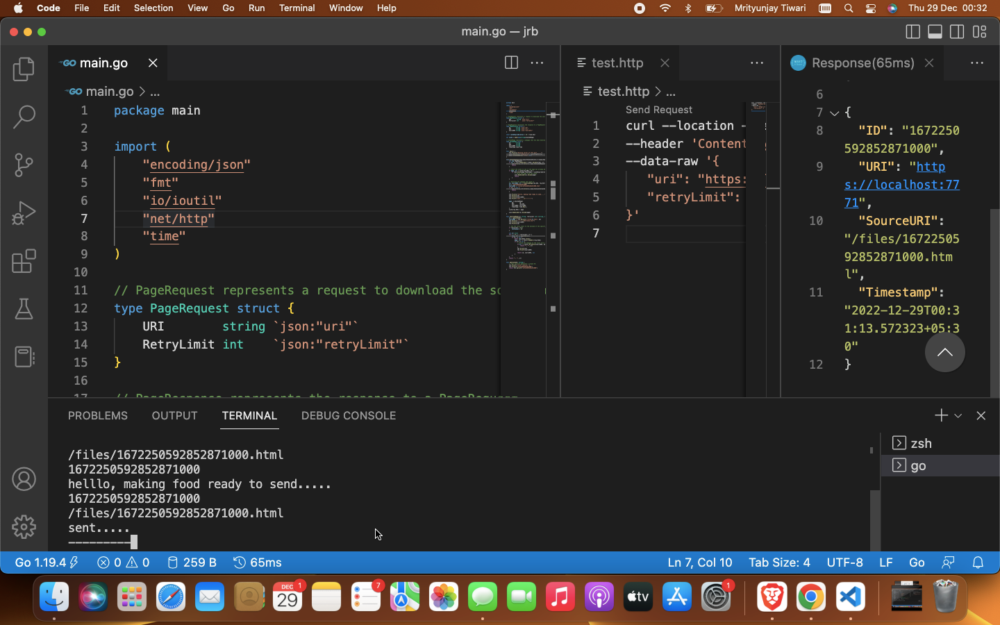
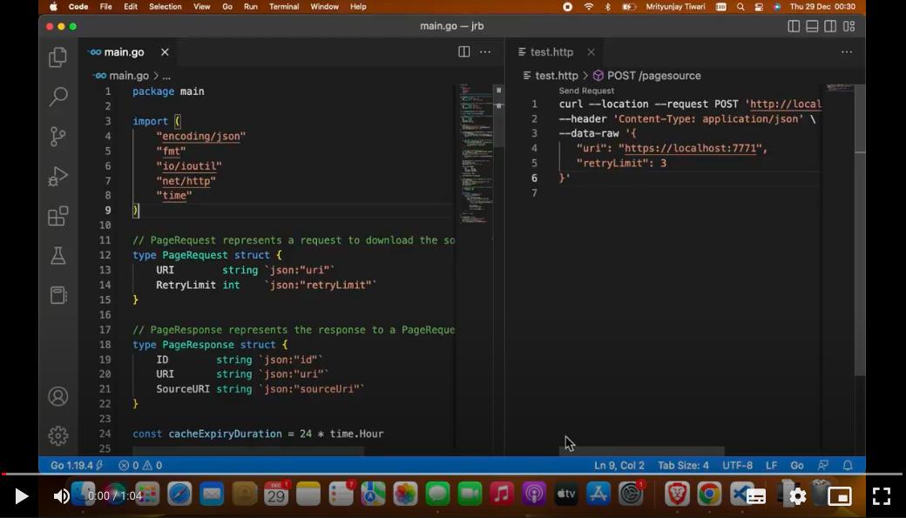
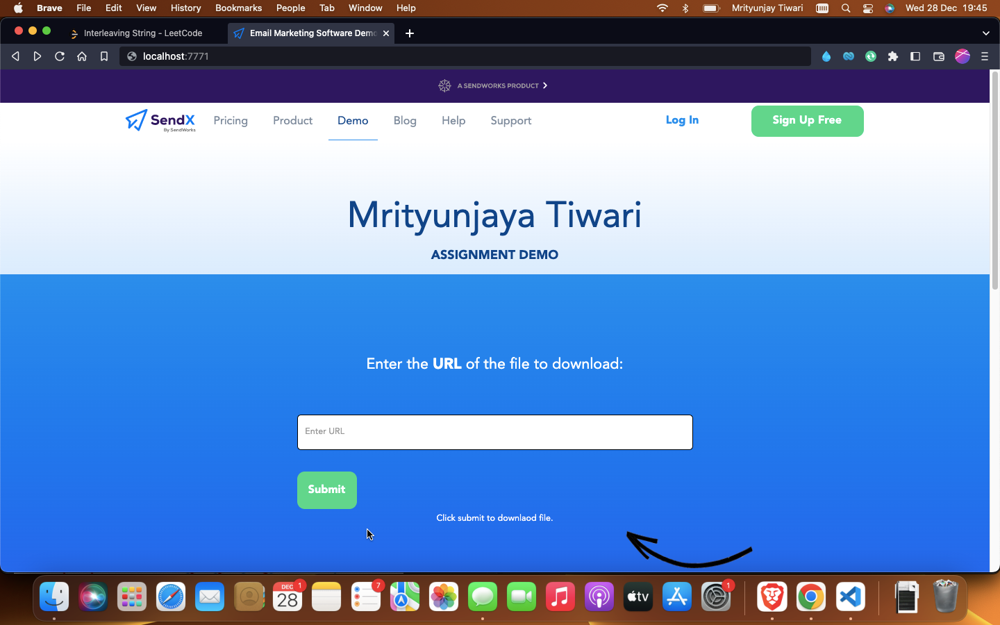
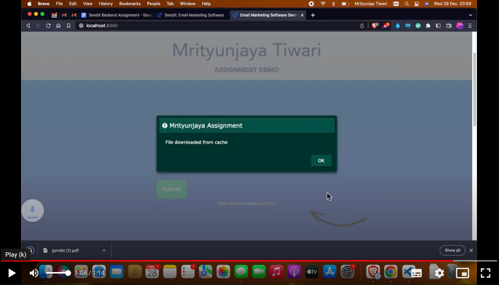

# SendX
Sendx Backend Assignment

<hr>

<!-- TABLE OF CONTENTS -->
<details open="open">
  <summary>Table of Contents</summary>
  <ol>
    <li>
      <a href="#Problem">About The Project</a>
    </li>
    <li><a href="#built-with">Built With</a></li>
    <li>
      <a href="#getting-started">Getting Started</a>
      <ul>
        <li><a href="#prerequisites">Prerequisites</a></li>
        <li><a href="#installation">Installation</a></li>
      </ul>
    </li>
    <li><a href="#how-to-use">How to use</a></li>
    <ul>
        <li><a href="#iiit-allahabad-virtual-museum-outside-look">Demo</a></li>
        <li><a href="#interactions-of-artifacts-with-avtar">SendX File Downloader</a></li>
      </ul>
     <li><a href="#demo-video">Demo Video</a></li>
     <li><a href="#Submitted-By">Submitted By</a></li>
     <li><a href="#important-project-links">Important Project Links</a></li>
  </ol>
</details>
<hr>

## Problem
Write a server endpoint which takes the URL of a webpage. After getting the URL it fetches the webpage and downloads it as a file on the local file system

The server accepts a retry limit as a parameter. It retries maximum upto 10 times or retry limit, whichever is lower, before either successfully downloading the webpage or marking the page as a failure

If the webpage has already been requested in the last 24 hours then it should be served from the local cache 

<hr>

## Built With
<ul>
   <li>GO</li>
   <li>HTML</li>
   <li>CSSt</li>
  <li>Javascript</li>
</ul>

<hr>

<!-- GETTING STARTED -->
## Getting Started

This is an example of how you may give instructions on setting up your project locally.
To get a local copy up and running follow these simple example steps.

### Prerequisites 

This is an example of how to list things you need to use the software and how to install them.
  * Software: GO 

 ### Installation

1. To run this code, you will need to have Go installed on your system. You can check if you have Go installed by running the following command in your terminal:
```sh
   go version
   ```
  If you do not have Go installed, you can download and install it from the official website: https://golang.org/dl/
  
2. Clone the repo
   ```sh
   git clone https://github.com/Error404m/sendx
   ```

3. Change directory to main file
   ```sh
   cd sendx
   ```
4. Open VS Code or any code editor . 
5. Run main.go
 ```sh
   go run main.go
   ```
   This will start the server and listen for requests on port 7771.

6. Wohoooo, Project is live .
 

<hr>

<!-- Usage -->
### How to use
To test the endpoint, you can use the curl command shown in the example request. Replace the URL in the request body with the URL of a webpage that you want to download.


1. For example, to download the homepage of Google:
   ```sh
   curl --location --request POST 'http://localhost:7771/pagesource' \ 
   --header 'Content-Type: application/json' \ 
   --data-raw '{
   "uri": "https://www.google.com",
   "retryLimit": 3 
   }'
   ```
2. You should receive a response similar to the following:
   ```sh
    {
    "id": "d27913f6-c8ea-11ea-81ea-9828a617c8db",
    "uri": "https://google.com",
    "sourceUri": "/files/d27913f6-c8ea-11ea-81ea-9828a617c8db.html" }

   ```

   
### Sample output
<br><br> 

## Demo Video
[](https://drive.google.com/file/d/1tITZMKPoAy3Jk9HyUauPFKURPPSXY1cv/view?usp=sharing)

<hr>

### SendX Demo | File downloader
I designed a page in Golang that takes URL by the user and download that data from that url. 

> If data is present in cache, then it serves from cache

> if Not present in cahce, Downloads from internet and serve and store in cache

<br><br> 
<!-- <br>  -->

<!-- Usage -->
<hr>

## Demo Video
[](https://drive.google.com/file/d/1ygLGZg_1ydED7jim4cLXwbzW848TzZSy/view?usp=sharing)

<hr>

<!-- Acknowledgements -->
## Submitted By
   
| Profile | Name | Email Id | 
| :-------------: | :-------------: | ------------- |
|  | Mrityunjaya Tiwari| IIT2019239@iiita.ac.in 
<hr>

<!-- Important Project Links -->
<!-- ## Important Project Links
* [Website Frontend (only for demo) ](https://error404m.github.io/Virtual_Museum/)
* [Report Docs](https://error404m.github.io/Virtual_Museum/)
* [PPT Presentation](https://error404m.github.io/Virtual_Museum/) -->

